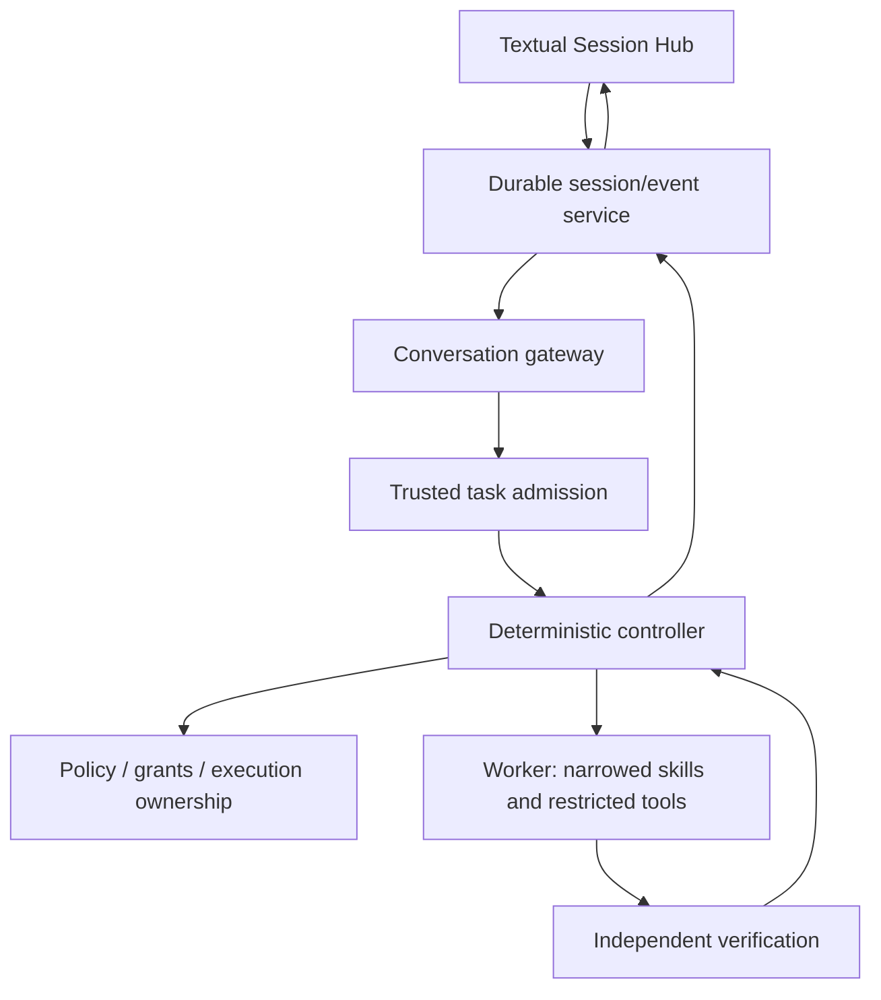

# Local Code Agent

Current implementation source of truth is live GitHub `main`. This document records durable architecture and product direction; `CURRENT_STATE.md` records the immediate implemented state and open gaps.

## Product goal

Build a dependable local worker for repository inspection, Git, bounded code changes, builds/tests and diagnosis. It should carry useful engineering work through to independently verified results without requiring a cloud model.

**The model is a replaceable dependency. The agent is the product.** Model/runtime/device independence means qualified configurations behind stable contracts, not a promise that every model works everywhere.

The active product target is an in-process Textual Session Hub around a deterministic controller. Users ask for outcomes. Internal route, skill and controller vocabulary should disappear behind natural requests except where authority or ambiguity genuinely requires clarification.

## Product laws

- Models propose. Deterministic code controls effects and evaluates proof.
- Durable admission happens before execution.
- Unknown state remains unknown. A missing or stale proof never becomes success.
- Verification belongs to the exact repository state and scope that produced it.
- Conversation is the request/discussion surface. Durable task/result/evidence records are the authority for engineering outcomes.
- The UI may project only evidence-backed facts. Configured, declared, observed and verified states are not interchangeable.
- No arbitrary model-generated shell, hidden cloud fallback, automatic push or silent worktree reset.
- User edits, staging and Git history are protected unless the user explicitly authorizes a capability that changes them.

## Implemented foundation

The current product foundation provides:

- a single public root launcher with the Textual Session Hub as the default interface
- canonical persisted conversations with lock-scoped ownership
- SQLite-backed durable task/event state with stable stream/session identity
- admission keyed by deterministic request identity before controller effects
- retained request and result artifacts with integrity checks
- restart reconciliation that never silently replays unknown effects
- deterministic read-only repository journeys and task-specific build/failure journeys
- typed product outcomes including explicit `NO_VERDICT`
- proof binding to request identity, repository state, mutation epoch and verification scope
- deterministic diagnostic follow-up for explicit durable task references
- process-local endpoint ownership/arbitration for conversation and worker calls
- explicit user stop requests with execution-epoch fencing
- Textual activity/result projection from durable task facts
- exact source provenance for the live product surfaces

Source mutation and commits remain disabled on the public conversation path until the trust and acceptance gates for those capabilities are closed.

## Architecture

Conversation turns and task artifacts are separate authorities. Raw user/assistant turns remain in the conversation store. Task admission, retained request/result artifacts, activity, evidence, verdict and terminal state are durable sibling records referenced by stable IDs.

## Runtime and model boundary

The controller talks to models through an OpenAI-compatible boundary. Runtime/device selection is deployment policy, not controller policy. A different compatible endpoint should not require changes to task admission, verification or durable state semantics.

Performance comparison uses one backend-agnostic harness under `internal/perf/`. It deliberately separates client-observed timings from backend-reported telemetry. Cancellation latency is reported only when endpoint-side observation proves when the request actually stopped.

Backend-specific harness profiles are local configuration and are not committed to the repository.

## Historical research archive

Earlier experimental machinery and collected artifacts were removed from the active product branch once they stopped informing current product decisions. The exact pre-cleanup repository state is preserved on branch `archive/legacy-experiments-2026-09-26` at commit `ad07af071a62acfa4d0168c7a89d7110a52088f6`.

Historical artifacts do not participate in current CI, source identity or product claims.

## Direction

The current priorities are:

1. Make the Session Hub truthful, obvious and dependable for normal engineering work.
2. Close cancellation, lifecycle and endpoint-ownership gaps with evidence rather than UI claims.
3. Complete physical offline acceptance on the target local machine.
4. Add safe mutation only after read-only and verification joins are trustworthy.
5. Extend Git, build/test and repository intelligence while keeping the controller deterministic and model-agnostic.
6. Treat endpoint/runtime performance as measured deployment data using the neutral harness, not as architecture folklore.

See `CURRENT_STATE.md`, `TRICKS.md` and `internal/docs/product-execution-priorities.md` for the current execution queue.
