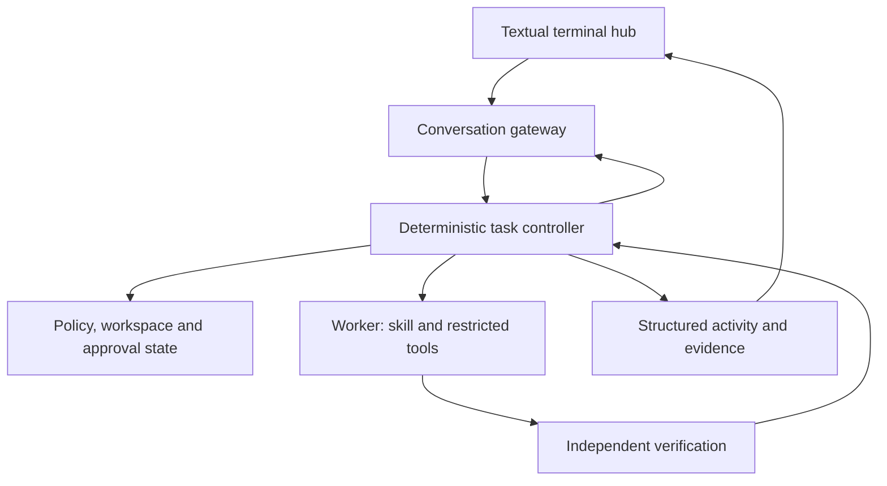

# Local Code Agent

Direction set: 2026-09-18. Baseline inspected on GitHub: `26fd55f0fc9705801e104d26afee377dac5db077`.

Design refinement: [session hub design](internal/docs/session-hub-design.md),
[typed event contract](internal/docs/session-contract/README.md) and
[file/PR layout](internal/docs/session-hub-file-layout.md) are the current target.
They supersede the earlier model-first routing and web/desktop client plan.
This refinement is design-only; the prototype below has not been upgraded to it.

## Product goal

Make LCA useful for building and testing LCA, then for recurring engineering work
on the Windows-to-Linux development setup. One continuous conversation is the
product surface. A deterministic controller retains ownership of permissions,
workspaces, skills, execution and verification.

**Short-term priority: the conversation product and its engineering loop.** New
measurement campaigns, pilot expansion and comparative model claims are paused.
Operational tests and telemetry remain necessary engineering tools. They do not
constitute a benchmark or demonstrate a local-model capability gain.

The previous measurement-first prioritisation is superseded for product work;
the historical evidence and experimental integrity rules remain binding.

## Architecture

Target routing is deterministic-first with a direct user Work path; a conversation
model can propose a fallback intent and has no repository tools. The existing
hardened orchestrator executes repository tasks. The gateway cannot set a
verification flag, choose an experimental condition, widen permissions or
approve itself. User corrections become controller constraints, not just prose
in an LLM history. That last step requires the planned task/approval state machine;
the initial synchronous prototype does not claim to implement interruption.

Start with one endpoint and two independent contexts. Chat and worker requests
are sequential. This is compatible with a single served weight instance; actual
runtime allocation and KV cache reuse must be observed, not assumed. Separate
chat/worker endpoints are supported by the prototype. Scheduling, resource
arbitration and automatic strong-tier escalation are later controller features.

## What exists on the product branch

- Strict conversation proposals and bounded, in-memory conversational history.
- A synchronous gateway and direct adapter to the existing hardened orchestrator.
- Fresh worker context per task; separate conversation context across turns.
- Fixed repository configuration, source/history mutations disabled, configured
  execution opt-in and intersected with repository policy.
- Sequenced activity events, task IDs and namespaced evidence references.
- Controller-rendered result status, independent of model wording.
- A Python self-check adapter using compileall and real pytest/JUnit. No CTest
  reinterpretation and no compatibility-runner output passed off as real pytest.
- Interface-only skeletons for persistence, scheduling, approvals, workspaces,
  telemetry and client transport. These are design contracts, not active services.

See [CURRENT_STATE.md](CURRENT_STATE.md) for operation and limitations.

## Next milestones

1. Wire existing chat_context persistence into plain chat.py; history is turns only.
2. Add a fixed-job scheduled runner and stable same-job deltas, without a chat model.
3. Implement the gateway contract, sibling task artifacts, cancellation and endpoint leases.
4. Add an in-process Textual hub with mandatory activity/evidence and watch panes.
5. Add telemetry last, after enforced exclusion from measured/scored runs.

Isolated editing and VS Code Remote SSH remain later goals. No web frontend,
Electron or browser engine is part of the current scope.

The implementation sequence, contracts, acceptance gates and failure paths are
in [the session hub design](internal/docs/session-hub-design.md)
and [the file/PR layout](internal/docs/session-hub-file-layout.md).

## Engineering rules that still apply

- Models propose; deterministic code controls effects and evaluates proof.
- Uncertain routing abstains. Invalid contracts fail closed.
- Proof belongs to the repository state and verification scope that produced it.
- A passing read tool does not mean a build passed. A model answer is not proof.
- An approval must bind to an exact action and current state; a chat message must
  not become a reusable permission token.
- Do not overwrite user edits, staging or history. Never silently reset worktrees.
- No arbitrary model-generated shell, automatic push, autonomous self-upgrade,
  or remote/cloud fallback without an explicit controller policy.
- Preserve frozen experiments and hashes. Product workflows are not experimental
  cells; do not mix them into earlier denominators or silently rescore old data.
- Keep source provenance declarations current. New methodology used for future
  measurements needs its own explicitly frozen experimental generation.

## Historical evidence

The historical 30B CPU smoke's 3/10 Control, 8/10 Narrow, 8/10 Skill result supports
an action-space narrowing signal on that fixture. It is not evidence of an 8B/NPU
gain, written-procedure superiority, or autonomous product readiness. Nothing in
the conversation branch changes that interpretation.

Historical detail remains in `internal/docs/project-history.md`, the frozen
`internal/experiments/` artifacts and their recorded source identities. Current
implementation is always the live repository. Uploaded snapshots are only useful
after comparison with that source of truth.
