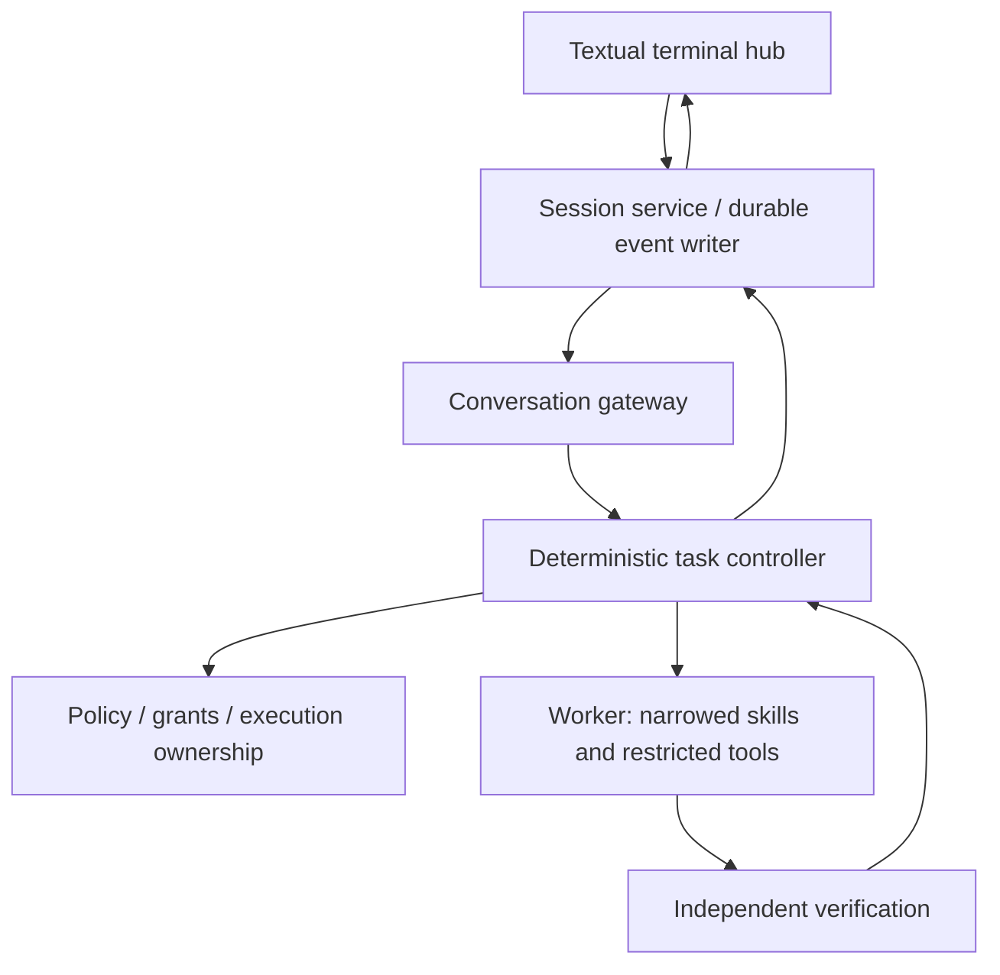

# Local Code Agent

Direction set: 2026-09-18. Current implementation source of truth: live GitHub `main` plus explicitly identified open PRs.

The current product target is an in-process Textual Session Hub around the existing deterministic controller. The model may propose work; deterministic code owns admission, permissions, execution, verification, provenance and durable state.

## Product goal

Make LCA useful for building and testing LCA, then for recurring engineering work on the Windows-to-Linux development setup. One continuous conversation is the user surface, but conversation prose is not the authority for repository state or task success.

Measurement collection is paused while the product loop is built. Historical experiments remain frozen and reproducible from their recorded tags and artifacts. Product hardening may move `source_sha256`; model-facing or outcome-facing experimental contract changes require deliberate generation handling.

## Implemented foundation on `main`

PRs #46-#48 established the current Session Hub foundation:

- persisted direct-chat conversations with lock-scoped ownership; existing conversations load only after the exclusive lock is acquired
- one explicit save path for owned conversations; abandoned in-memory edits are not auto-saved
- product-side outcomes are closed and typed, including `NO_VERDICT`
- successful outcomes require verification to have been established
- product outcomes have explicit lifecycle/verdict projections and bounded CLI exit classes
- route provenance is recorded before deterministic routing becomes richer
- controller/worker exceptions fail closed to unknown/no-verdict semantics rather than success-shaped completion
- Generation-2 evaluator success is executable-frozen as `pass` and `escalated_pass`, with the outcome-contract hash pinned before any Gen2 model rows exist
- evaluator ledger reporting cannot silently drop an unfamiliar outcome; unclassified rows remain visible
- behavioural Session Hub acceptance gates replaced prose-presence checks

Source mutation and commits remain disabled on the conversation product path.

## Active implementation sequence

PR #49 is the durable event-service slice. It is intentionally separate from routing/UI work and is not part of `main` until merged. Its target is:

1. executable validation of the reviewed `lca.session.events/1` envelope/payload contract
2. one durable writer owning event sequence, task admission and terminal persistence
3. admission-before-execution and idempotent request identity
4. live/replay equivalence from persisted events
5. crash recovery to an explicit unknown/NO_VERDICT state with no automatic effect replay
6. non-blocking task submission and bounded thread-safe subscriptions for the future Textual loop

After that, the planned slices are deterministic routing + fixed watch execution, fixture-driven Textual UI, then live wiring/endpoint arbitration/cancellation acceptance.

## Architecture

Conversation turns and task artifacts are separate authorities. Raw user/assistant turns remain in the conversation store. Task admission, activity, evidence, verdict and terminal state are sibling durable records referenced by stable IDs. Controller verdict/evidence is not stuffed back into model chat history.

Target routing remains deterministic-first: control commands, explicit Work/Chat choice, anchored rules, model proposal fallback, then clarification. A model proposal is advice, not permission.

## Engineering rules

- Models propose; deterministic code controls effects and evaluates proof.
- Uncertain routing abstains. Invalid contracts fail closed.
- Durable admission is the fence before execution. Replay must never re-execute effects.
- An admitted task without a durable terminal record after restart is unknown, not retryable success/failure.
- Proof belongs to the repository state and verification scope that produced it.
- Cancellation is an execution property, not a UI label; unknown process cleanup means `NO_VERDICT`.
- Do not overwrite user edits, staging or history. Never silently reset worktrees.
- No arbitrary model-generated shell, automatic push, autonomous self-upgrade or hidden cloud fallback.
- Preserve frozen experiments and hashes. Product workflows do not retroactively change historical denominators or methodology.

## Historical evidence

Generation 1 used Qwen3-Coder-30B on the NUC under WSL2 Ubuntu/llama.cpp. The frozen legacy `succeeded` accounting gives Control 9/30, Narrow 22/30 and Skill 23/29, with action-space narrowing the strongest measured signal. A later typed `verified_completion` characterization gives 1/30, 12/30 and 9/29 on the same frozen rows; the narrowing direction survives while the written-skill contrast changes sign. This characterization does not rescore or rewrite Generation 1.

Historical detail remains in `internal/docs/project-history.md`, the frozen `internal/experiments/` artifacts and recorded source identities.
