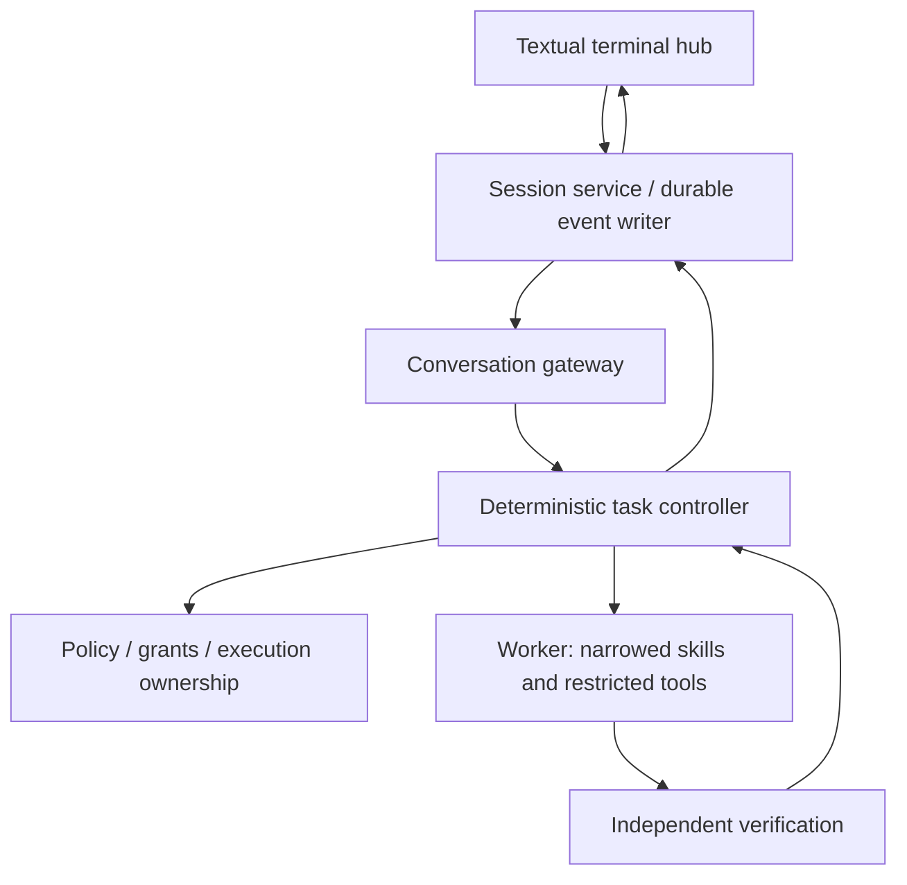

# Local Code Agent

Current implementation source of truth: live GitHub `main`. This document describes
capabilities, not in-flight work. PR numbers and merge status belong in
`internal/docs/review-history.md` and the changelog, because a document that names an
open PR is wrong the moment that PR lands and nobody notices for weeks.

The current product target is an in-process Textual Session Hub around the existing deterministic controller. The model may propose work; deterministic code owns admission, permissions, execution, verification, provenance and durable state.

## Product goal

Make LCA useful for building and testing LCA, then for recurring engineering work on the Windows-to-Linux development setup. One continuous conversation is the user surface, but conversation prose is not the authority for repository state or task success.

Measurement collection is paused while the product loop is built. Historical experiments remain frozen and reproducible from their recorded tags and artifacts. Product hardening may move `source_sha256`; model-facing or outcome-facing experimental contract changes require deliberate generation handling.

## Implemented foundation on `main`

The Session Hub foundation on `main` provides:

- persisted direct-chat conversations with lock-scoped ownership; existing conversations load only after the exclusive lock is acquired
- one explicit save path for owned conversations; abandoned in-memory edits are not auto-saved
- product-side outcomes are closed and typed, including `NO_VERDICT`
- successful outcomes require verification to have been established
- product outcomes have explicit lifecycle/verdict projections and bounded CLI exit classes
- route provenance is recorded before deterministic routing becomes richer
- controller/worker exceptions fail closed to unknown/no-verdict semantics rather than success-shaped completion
- Generation-2 evaluator success is executable-frozen as `pass` and `escalated_pass`, with the outcome-contract hash pinned before any Gen2 model rows exist
- evaluator ledger reporting cannot silently drop an unfamiliar outcome; unclassified rows remain visible
- behavioural Session Hub acceptance gates replaced prose-presence checks

Source mutation and commits remain disabled on the conversation product path.

## Active implementation sequence

The durable event service exists in `main` as `local_agent/session/`: schema validation
against the versioned `lca.session.events/1` contract, SQLite WAL storage, one writer
owning sequence assignment, admission keyed by request identity, replay from committed
events, bounded subscriptions, and recovery of admitted-without-terminal tasks to an
explicit unknown state rather than automatic retry.

The current durable-correctness gate is closed around that foundation:

- final verdict, closure, terminal task state and result indexing commit atomically;
  generic append paths cannot manufacture half-terminal tasks
- recovery is scoped to the owning durable stream and never re-executes unknown effects
- accepted writes are linearized ahead of writer shutdown; a returned receipt cannot be
  stranded behind the shutdown sentinel
- the durable task index owns non-terminal state and execution epoch continuity; stale
  state or stale-epoch events fail closed without advancing the stream
- replay-to-live subscription handoff captures an explicit durable boundary so a
  concurrent commit is either replayed or delivered live, never silently lost; live
  overflow remains an explicit gap requiring durable replay

What it is not yet, stated because a diagram makes it look finished:

- **no user entry point reaches it.** `DurableSessionService` is constructed by the
  acceptance script and by tests. Ordinary product use does not yet write task or event
  lifecycle records through it. Raw conversation persistence is a separate authority and
  is wired: the gateway loads and saves owned conversations through the conversation
  store.
- **most declared event kinds are not yet emitted by the live product path.** Producer
  code exists for the task lifecycle kinds. A subscriber written against the full
  contract today would see silence on most of the rest.

The durable layer now has the correctness fences required before product wiring depends
on it. The remaining product slices are deterministic routing and fixed watch execution,
task/run ownership plus endpoint/cancellation semantics, the fixture-driven Textual UI,
then live controller/endpoint wiring and physical-laptop acceptance.

## Architecture

Conversation turns and task artifacts are separate authorities. Raw user/assistant turns remain in the conversation store. Task admission, activity, evidence, verdict and terminal state are sibling durable records referenced by stable IDs. Controller verdict/evidence is not stuffed back into model chat history.

Target routing remains deterministic-first: control commands, explicit Work/Chat choice, anchored rules, model proposal fallback, then clarification. A model proposal is advice, not permission.

## Engineering rules

- Models propose; deterministic code controls effects and evaluates proof.
- Uncertain routing abstains. Invalid contracts fail closed.
- Durable admission is the fence before execution. Replay must never re-execute effects.
- An admitted task without a durable terminal record after restart is unknown, not retryable success/failure.
- Proof belongs to the repository state and verification scope that produced it.
- Cancellation is an execution property, not a UI label; unknown process cleanup means `NO_VERDICT`.
- Do not overwrite user edits, staging or history. Never silently reset worktrees.
- No arbitrary model-generated shell, automatic push, autonomous self-upgrade or hidden cloud fallback.
- Preserve frozen experiments and hashes. Product workflows do not retroactively change historical denominators or methodology.

## Historical evidence

Generation 1 used Qwen3-Coder-30B on the NUC under WSL2 Ubuntu/llama.cpp. The frozen legacy `succeeded` accounting gives Control 9/30, Narrow 22/30 and Skill 23/29, with action-space narrowing the strongest measured signal. A later typed `verified_completion` characterization gives 1/30, 12/30 and 9/29 on the same frozen rows; the narrowing direction survives while the written-skill contrast changes sign. This characterization does not rescore or rewrite Generation 1.

Historical detail remains in `internal/docs/project-history.md`, the frozen `internal/experiments/` artifacts and recorded source identities.
