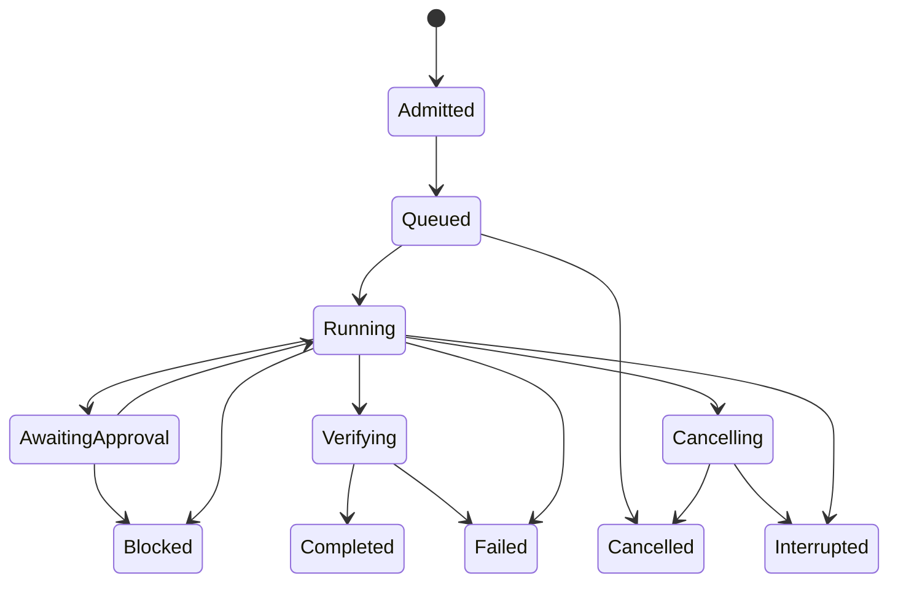

# Conversation product architecture

> Historical first design. [Session hub design](session-hub-design.md),
> [event contract](session-contract/README.md) and
> [file/PR layout](session-hub-file-layout.md) supersede conflicting target choices.
> In particular: deterministic-first routing, in-process Textual (no web client),
> existing chat persistence first, fixed watch runner next, mandatory watch/activity,
> sibling task records and measurement-excluded telemetry. Prototype descriptions
> below still describe d4a4cfa; this document is not the current build-order authority.

Status: accepted direction, staged implementation. 2026-09-18.
Baseline inspected: `26fd55f0fc9705801e104d26afee377dac5db077`.

This document distinguishes **implemented v0**, **required next**, and **later**.
Interfaces in `local_agent/session/` without implementations are deliberate
skeletons. They must not be exposed as working capabilities in a UI.

## 1. Target outcome

One conversation should support: inspect repository -> explain a failure ->
propose a fix -> review/apply a permitted patch -> test -> review diff -> commit
approved paths. Alongside it, an activity pane shows real controller events and a
status strip shows attributed runtime measurements. Terminal and desktop are
clients of the same gateway. Neither has privileged shortcuts around policy.

The first engineering use case is LCA improving a separate candidate checkout of
LCA. Success is a real reviewed patch with current-tree test evidence, not a
conversation that sounds convincing. A fully autonomous, self-modifying controller
is explicitly outside the plan.

No new research campaign is a prerequisite. Keep regression/integrity tests, raw
runtime observations and provenance; defer comparative experiment design.

## 2. Existing integration points

| Existing component | Actual boundary | Product decision |
|---|---|---|
| `internal/scripts/chat.py` | Direct chat, serving ownership and personas | Keep direct-chat mode; reuse serving lifecycle later |
| `local_agent.agent.Orchestrator` | Exports hardened `contracts.Orchestrator` | Use this export, never accidentally bypass it with base class |
| `agent/skills.py` | Deterministic ranking, skill disclosure | Controller routes; chat cannot pin an experiment skill/condition |
| `tools/` and `agent/policy.py` | Allowlisted operations, approvals | Preserve policy; add workspace-scoped grants before edits |
| `agent/state.py`, `verification.py` | Typed outcomes and current-tree proof | Adapt result fields, never parse terminal prose for success |
| Observer `(event, payload)` | Synchronous callback | Project into versioned session events; no screen scraping |
| `llm/client.py`, `llm/models.py` | Transport and CallStats | Reuse for each role; separate histories and attribution |
| `llm/router.py` | Cheap/strong tier routing | Later wrap in role scheduler and explicit escalation policy |
| `tools/testing.py` | CTest parsing and binary freshness | Do not pretend this is a general Python adapter |
| `measurement/serve.py` | Owned server lifecycle | Integrate without stealing/stopping unmanaged servers |

## 3. Component ownership

| Component | Owns | Must not own |
|---|---|---|
| Client UI | Text entry, activity display, explicit user decisions | Tool execution, approval inference, result classification |
| Conversation gateway | Session turns, context selection, intent proposals | Shell access, repo roots, policy edits, success flags |
| Task controller | Admission, route, grants, state transitions, budgets | Free-form model judgement as proof |
| Worker orchestrator | Bounded model/tool loop under assigned capability | Broadening its own scope, changing verification rules |
| Workspace manager | Leases, isolated candidates, state fingerprints | Resetting unrelated user changes |
| Verifiers | Test/build evidence and freshness | Interpreting conversational confidence |
| Endpoint scheduler | Residency policy, queues, per-role limits | Allowing hardware fallback to alter permissions |
| Event/evidence store | Ordered events and immutable artifacts | Turning a persisted status into current proof |

V0 `TaskController` is an adapter, not a replacement for the worker's deterministic
loop. It constructs a fresh registry and worker per task and forces source/history
mutation permissions off. Execution is `user opt-in AND repository policy`.

## 4. Session and task contracts

### Implemented v0 proposal

The chat endpoint gets no tools. It returns a single strictly parsed JSON object:

```json
{"kind":"repository","text":"Locate internal/personas/aiden.toml and review its contents without changing files."}
```

Allowed kinds: `reply`, `repository`, `self_check`. Exactly two fields, no unknown
keys, duplicate keys, arrays, fenced markdown or hidden tool calls. Maximum input
and proposal text: 8,000 characters. Invalid output causes no task execution and
no automatic retry. The original user text accompanies any reformulation.

`reply` is labelled conversation only. It cannot create a controller result.
`self_check` maps to fixed Python commands, not a model-generated argv. `/check`
is the model-free equivalent and still passes policy.

### Required next persisted records

`Session`: UUID, schema version, repository/workspace IDs, controller commit,
policy revision, role endpoint IDs, conversation cursor, task IDs, pinned user
constraints, creation/expiry, retention policy. Root paths come from trusted
session admission, never the model.

`TaskRequest`: UUID, idempotency key, originating user turn ID, objective,
referenced task/artifact IDs, requested operation category, declared path scope,
deadline, model/tool/token budgets. Proposal fields are untrusted until admitted.

`AdmittedTask`: controller-selected skill, endpoint policy, allowed tools,
effective path scope, workspace lease, immutable config/skill hashes, verification
plan, starting tree digest and scope revision. Admission must reject unknown
capabilities; persistence without enforcement is insufficient.

`TaskResult`: typed completion state, typed domain outcome, answer text labelled
as model-authored, verifier findings, evidence IDs, artifacts, starting/ending
tree digests, source/config identities, actual endpoint identities, usage and
halt reason. A structured result survives even if final prose generation fails.

`EvidenceRef`: session/task/attempt/tool-call namespace, artifact digest, local
tool evidence ID, verification scope, tree epoch and timestamp. V0 keeps canonical
`name:index` IDs unchanged and carries `task_id` in a separate EvidenceRef field;
durable artifact resolution follows the superseding session-hub design.
Never resolve a citation from one task into another task's same `read_file:0`.

## 5. State and interruption

Required state machine (v0 runs only the synchronous subset):



State transitions use compare-and-swap revision updates. Terminal transition is
recorded once. Progress events cannot move a terminal task back to running.

“Leave that file alone” is a control operation. In M2/M3 the input channel remains
available while the worker runs. A new exclusion increments scope revision,
revokes pending approvals, and fences subsequent tool dispatch. A tool already
writing cannot be described as cancelled retroactively. Finish/interrupt at a
safe boundary, inspect actual bytes, and ask about any compensating change. Never
auto-revert concurrent human edits. A normal chat queue is not an interruption API.

Cancellation needs a token checked before model calls, before tools and before
each write. The process runner must own process groups on POSIX and job objects
or equivalent process-tree cleanup on Windows. Cancel request acknowledgement
means received; cancellation completion means child cleanup and mutation state
have been reconciled. A transport timeout is not proof the remote work stopped.

V0 refuses concurrent turns. Ctrl-C exits and explicitly leaves cleanup uncertain.
No GUI Stop button should be shipped until these stronger semantics exist.

## 6. Model roles and hardware scheduling

| Stage | Chat | Worker | Strong | Scheduling |
|---|---|---|---|---|
| V0 | Configured endpoint | Same endpoint, fresh context by default | Disabled on session path | Serial turns and calls |
| M2 | Same or separate local endpoint | Local role endpoint | Still explicit/off by default | One lease per physical endpoint; bounded FIFO |
| M5 | Small local role | Capability-qualified coder role | Optional larger local/cloud endpoint | Controller reasons, budgets and data policy |

One loaded model with two histories is the initial deployment, not two mutually
conversing agents. Do not force alternating critique loops. The usual task needs
one intent call followed by worker calls, then a controller-rendered result.
Optional answer synthesis gets a bounded evidence packet and cannot alter badges.

Profiles are deployment hypotheses until qualified on the actual host. Do not
promise an arbitrary 8B coder fits the NPU or that two NPU models coexist. Record
model artifact/revision, quantisation, runtime/version, observed device, context
limit and tool-call compatibility during bring-up. No additional model purchase
or download is required to implement the gateway.

Endpoint registry fields: endpoint ID, URL, credential reference (not secret),
model ID, runtime identity, device/host ID, declared and observed capabilities,
context/output limits, concurrency cap, startup owner and health state. Distinct
profiles pointing at the same endpoint share a lease. Two profiles differing only
by URL aliases must not evade the concurrency cap.

Chat, worker and strong have independent token limits, temperatures and histories.
Do not mutate shared preset objects. Serial same-endpoint calls may evict each
other's prefix cache; measure this during laptop operation. “Shared weights” does
not guarantee shared KV cache or low switching overhead. Background chat can
remain responsive on a separate endpoint; on one endpoint it waits for a bounded
worker call. User control messages do not need inference and take immediate priority.

Escalate only on typed eligible failures: exhausted bounded repair attempts,
unsupported required capability, unresolved verified failure. Do not escalate
policy refusal, unavailable build tools, user denial or unknown execution state.
Restore only journal-owned speculative changes, validate the restored tree, pass
deterministic observations instead of cheap-model reasoning. Stage/commit remains
outside speculative retries. Strong/cloud access has independent data and budget
policy and never happens as an invisible quality fallback.

## 7. Conversation memory and evidence

V0 keeps bounded recent user/result pairs in RAM; each worker starts fresh. It
trims whole pairs and emits a trim event. Conservative serialized request byte
limits reduce overflow risk; these are not a tokenizer or runtime qualification.
Any context-overflow error must stop that call without executing tools.

M2 memory has three stores: exact user constraints/controller state, bounded
conversation prose, and referenced task artifacts. Summaries may compact prose;
they cannot compact away exclusions, pending approvals, unresolved results or
verification identity. Worker receives the active objective and selected relevant
evidence, not the full friendly conversation/persona.

“Why did that fail?” should bind to a specific most-recent failed task. If two
plausible tasks exist, ask a short clarification. “Fix it” inherits that target,
not its permissions or proof. Repository text, logs, READMEs and prior model
answers are untrusted content even when stored locally. Retrieved instructions
cannot widen tool policy or manufacture approval. Prompt-injection resistance
depends on enforced effects, not on expecting a small model to notice an attack.

Proof is scoped to its tree, command/profile, environment and verifier version.
Before using old proof for a new action, check the required state identity. UI
shows historical passed-at-completion separately from current verified state.
After edits, “tests passed earlier” is history, not a green badge for the new tree.

## 8. Changes, approvals and self-engineering

M3 pipeline:

1. Start pinned controller version in checkout A. Admit candidate worktree B at a
   recorded commit, preserving any user dirty/index state outside B.
2. Select a fixed task scope and protected paths. Protect controller policy,
   credentials, artifacts and frozen experiments from normal edit tools.
3. Worker proposes a patch; controller computes exact diff/path digest and checks
   it against scope. Proposed tests are visible for review, not silently trusted.
4. Apply covered user grant or request approval bound to the exact action, current
   tree, workspace and policy revision. Approval expires/is single-use and cannot
   be reused for a different diff. New exclusions immediately invalidate it.
5. Apply in B with journalled before/after hashes. Check the bytes still match the
   admitted base; reject races instead of overwriting.
6. Run independent compile/test/lint commands selected by trusted project adapters.
   Include pre-existing external regression gates; the candidate cannot delete
   its failing tests and thereby certify itself. Report changed verification code.
7. Show patch, actual checks, known omissions and remaining failures. Commit only
   explicit allowed paths in B, without incorporating the user's unrelated staged
   files. Import/merge is a separate operation. Push remains manual until its own
   explicit policy/tool exists.
8. To promote candidate controller B, stop/restart explicitly from the reviewed
   commit. Never reload new policy/tool code inside an already-admitted task.

Approvals are not necessary for every read or every authorised configured check.
Standing grants can cover a task's declared actions; the controller must verify
coverage, not repeatedly ask the user. Conversely, an LLM interpretation of
“nice, go ahead” must not approve a different action or changed tree.

Local process execution remains trusted-checkout execution. Build/test code can
write files or access the network independently of the model tool policy. Add OS
isolation for untrusted repositories before describing this as a secure sandbox.

## 9. Build/test adapters

Do not weaken CTest's binary-freshness contract to make Python look green.
V0 `selfcheck.py` runs a fixed compileall command and real pytest over
`internal/tests`, produces a unique JUnit file, requires nonempty executed tests,
zero failures/errors, successful process exit and matching pre/post tree digest.
It checks content changes to untracked files too, not just their names. Missing,
malformed, all-skipped or inconsistent reports cannot certify success.

V0 scope excludes ignored dependencies/outputs and cannot detect a transient
change restored before the end. Tests are trusted verification code, not a
cryptographic adversarial oracle. M3 adds exclusive workspace leases and trusted
verification manifests. Runtime/controller/tool versions need to enter the final
evidence packet, not merely a decorative log line.

Next adapters should implement a common `VerificationPlan` with explicit commands,
working directory, environment allowlist, test selection, expected report format,
minimum executed-test threshold, timeout, result/artifact schema and freshness
predicate. Full versus targeted checks are separate proof kinds. A filtered test
run must never be shown as all tests passing. Compilation success is not test
success. Lack of a model endpoint is not lack of a build tool.

Python self-check does not use or alter `.local-agent.toml`'s compatibility runner
entry or the old experimental tool's semantics. A future general adapter change
must have its own contract tests and documented instrumentation boundary.

## 10. UI and transport

Terminal v0 prints a conversation and sequenced activity lines. The next terminal
client uses a persistent chat panel, read-only activity panel and status strip.
Desktop is a client of the same service. Do not embed PowerShell windows.

Desktop layout: left 55% chat with fixed composer; right 45% activity grouped by
task/attempt; bottom 2-row runtime strip. Narrow windows stack activity under chat.
Outcome card links to exact diff/log artifacts. A green badge comes only from a
controller event. Use distinct states for running, awaiting approval, blocked,
failed, interrupted, completed without proof, and passed with stated scope.

Transport progression: in-process adapter -> versioned stdio JSON-RPC -> loopback
HTTP commands plus SSE events for desktop. Keep transport DTOs shared and small.
Streaming a model token is a presentation event, not a task-completion signal.
Tool arguments/results are not broadcast by default; open artifacts explicitly.

Proposed RPC operations:

| Method | Main inputs | Result |
|---|---|---|
| `session.create` | trusted repo ID, role profile IDs, grant policy | session ID, revision, capabilities |
| `turn.submit` | session ID, unique request ID, expected revision, text | turn/task admission result |
| `task.cancel` | task ID, request ID, reason | cancellation requested; later terminal event |
| `approval.respond` | request ID, exact action hash, approve/deny | accepted/rejected with scope revision |
| `events.subscribe` | session ID, after-sequence | stream or explicit replay-gap response |
| `session.snapshot` | session ID | controller state, task summaries, current sequence |

Default bounds: 64 KiB command frames, 1 MiB explicit artifact chunks, 512 in-memory
events in v0, paged durable history later. Slow clients cannot block tools or cause
unbounded RAM growth. Persist terminal state even if a client disconnects. Replay
never re-executes a task. Disconnected/lagging clients must resnapshot after a gap.

Loopback still needs a per-launch random token, Origin validation and no wildcard
binding. Never expose an unauthenticated tool server. Stdio child lifecycle is the
preferred VS Code boundary. Do not expand the existing RPC experiments silently;
version and test the product protocol separately.

## 11. Telemetry without invented numbers

| Metric | Source | Missing-data behaviour |
|---|---|---|
| TTFT | Streamed CallStats | N/A for nonstreaming |
| Token throughput | Completion count / measured decode interval | N/A when interval/count unavailable |
| CPU and system RAM | Host sampler | Label host and sample time |
| GPU/NPU utilisation | Validated device-specific collector | Unavailable with reason, never zero |
| Model memory/residency | Runtime/process observation | Separate estimate from observation |
| Active skill/calls/outcome | Controller events | No inference from printed prose |

Model host can be Windows and tool host Linux. Show both. CPU percentage from the
Linux VM says nothing about the Windows NPU. Host totals do not equal this task's
exclusive usage. Samples need timestamp, collection interval, attribution source,
device identity and freshness; display stale samples as stale. Start at 1 Hz and
validate collector overhead. Product operational samples are not experimental
energy measurements or proof of savings.

## 12. Failure and recovery decisions

| Event | Required behaviour |
|---|---|
| Malformed chat proposal | No task; retain useful conversation; bounded retry only if explicitly designed |
| Chat invents tool calls | Reject; never forward calls to registry |
| Uncertain skill routing | Existing abstention; policy still narrows actual effects |
| Worker/server unavailable | Typed error; no “task completed”; do not retry mutations blindly |
| Front-end summary fails after successful task | Keep immutable task result; render deterministic fallback |
| Budget exhausted | Stop at safe boundary; preserve partial evidence and unapplied patch |
| Verification report absent/zero tests | Fail or blocked; never verified |
| Repo changes after approval | Invalidate grant and proof; re-admit exact action |
| Event subscriber fails | Preserve execution result; mark delivery failure/reconnect |
| Controller crashes during mutation | Recover interrupted; reconcile before any retry |
| RPC retry after lost response | Idempotency lookup; return same task, never a duplicate effect |
| Two sessions target same worktree | Exclusive lease; queue/reject second writer |
| Endpoint becomes unhealthy | Release lease safely; explicit restart/fallback policy |
| Disk full / storage failure | Stop before side effects that cannot be recorded |
| Remote disconnect | Task state unknown until authenticated reconciliation |

## 13. Release gate and non-goals

First useful release: the actual laptop can inspect this repo, run `/check`,
explain a real failure from saved evidence, propose a bounded fix in an isolated
candidate, rerun checks and present a reviewable diff in one session. It must
reject forbidden edits, stale approvals, stale test proof and duplicate requests.

V0 delivers the inspection/check foundation; it does not meet that full gate yet.
No claims of production readiness, benchmark improvement, reliable small-model
intent recognition, live device utilisation or autonomous self-development follow
from mocked integration tests.

Non-goals for this phase: model training, inventing a distributed agent society,
automatic internet research, cloud fallback by surprise, plugin marketplaces,
unrestricted shell, changing frozen experiments, and polished dashboards ahead
of the working edit/test loop.
